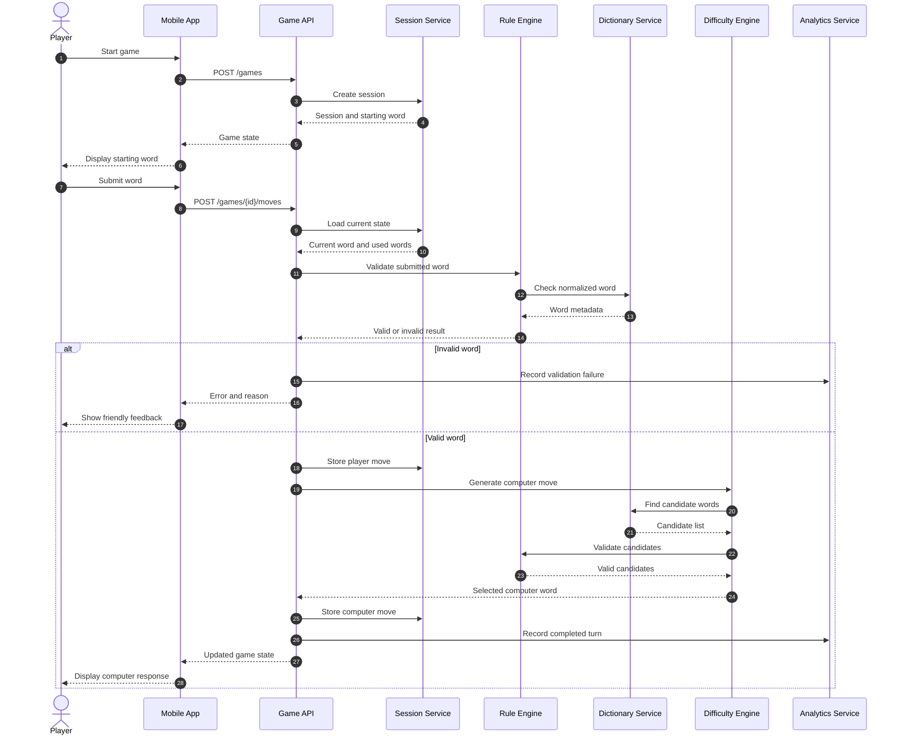

# WordLoop Product Requirements Document

**Version:** 0.1  
**Status:** Draft  
**Product type:** Mobile word game  
**Platforms:** iOS App Store and Google Play  
**Initial audience:** Casual players and learners  
**Future audience:** Teachers, schools, parents, and educational institutions  

## 1. Product summary

WordLoop is a casual turn-based word game in which each new word must begin with the final letter of the previous word.

The first release will allow one player to compete against a computer opponent. The game will combine entertainment with light vocabulary learning through word discovery, optional definitions, hints, and post-game review.

The initial commercial strategy is consumer distribution through the App Store and Google Play. School sales will be explored only after gameplay data and user feedback demonstrate that the product has educational value.

## 2. Product vision

WordLoop should make vocabulary practice feel like a quick, replayable challenge rather than a formal lesson.

The product should be:
- Easy to understand within seconds.
- Fast enough for casual play.
- Fair and predictable.
- Friendly toward learners.
- Challenging without feeling impossible.
- Extensible into a school product later.

## 3. Problem statement

Many vocabulary activities feel repetitive or instructional. WordLoop creates pressure to recall words quickly while maintaining a simple rule that players can understand immediately.

The product must solve two different problems:

- For casual players: provide an enjoyable and replayable word challenge.
- For learners: expose players to new words without making the game feel like a test.

These goals may conflict. The game should therefore keep the main interaction fast and make definitions, pronunciation, hints, and word review optional.

## 4. Goals

### Primary goals

- Build a reliable single-player word-chain game.
- Validate every move consistently.
- Provide three understandable difficulty levels.
- Make the game enjoyable for casual users.
- Support optional vocabulary learning.
- Release an initial mobile version.

### Secondary goals

- Collect evidence of user engagement.
- Identify disputed or confusing words.
- Discover whether users want learning features.
- Test whether teachers or parents see educational value.
- Prepare the technical foundation for future school features.

## 5. Non-goals for v1

The following are outside the first release:

- Real-time multiplayer.
- School administration dashboards.
- Teacher accounts.
- Class management.
- Curriculum alignment.
- Student progress reporting.
- Full dictionary definitions for every word.
- Social profiles.
- Global competitive leaderboards.
- Complex subscriptions.
- Institution-specific deployments.

These features may be considered after the core game has demonstrated user demand.

## 6. Target users

### Casual players

They want a quick game that is easy to start and does not require prior knowledge of formal word-game rules.

### Learners

They want to encounter, understand, and remember new vocabulary through play.

### Parents

They may value a safe game that provides light educational benefits.

### Teachers

They may eventually use WordLoop as a short vocabulary activity.

### Schools and institutions

They may eventually purchase a managed version with controls, word lists, and reporting.

The first launch should not assume that schools are the initial buyer. The first objective is to learn whether players return to the game.

## 7. Core gameplay

A round follows this sequence:

1. The game provides a starting word.
2. The player enters a word.
3. The submitted word must begin with the final letter of the previous word.
4. The app validates the word.
5. The computer selects a valid response.
6. The game continues until one side has no valid move or reaches another ending condition.
7. The game displays the result and optional learning feedback.

### Example

```text
Computer: apple
Player must submit a word beginning with E.

Player: elephant
Computer must submit a word beginning with T.

Computer: table
Player must submit a word beginning with E.
```

## 8. Core game rules

### 8.1 Letter chaining

The first alphabetic character of the new word must match the last alphabetic character of the previous word.

For v1:

```text
previous word: apple
required letter: e
valid example: elephant
invalid example: river
```

### 8.2 Word normalization

Before validation, the system should:

- Trim leading and trailing spaces.
- Convert input to lowercase for comparison.
- Remove permitted punctuation if the product later supports it.
- Preserve the display form separately if required.
- Reject empty input.
- Reject numbers and unsupported symbols.

### 8.3 Minimum word length

Recommended v1 rule:

- Minimum length: 3 letters.

This prevents extremely short words from making the game repetitive or trivial.

### 8.4 Repeated words

The same exact word cannot be used twice in one round.

The system should compare normalized forms, so `Apple` and `apple` count as the same word.

### 8.5 Proper names

Personal names are forbidden as standalone proper nouns.

Examples to reject:

- Peter.
- James.
- Newton.
- Ajay.
- Ravi.
- Ganesh.

The rule should also reject:
- Place names.
- Brand names.
- Company names.
- Organisation names.
- Other proper nouns.

However, a common word should not be rejected merely because it can also be a person’s name.

For example, `rose` may be accepted as a common noun referring to a flower. The dictionary classification should determine the result rather than a simple global name blocklist.

### 8.6 Plurals and verb forms

Word forms such as `cats`, `walked`, `playing`, and `faster` are called **inflected forms**. They are grammatical variations of a base word.

Recommended v1 policy:

- Accept valid dictionary-listed plurals.
- Accept valid verb forms.
- Accept common comparative and superlative forms.
- Reject exact duplicates.
- Record the base form where dictionary data supports it.
- Do not initially reject every related form from the same word family.

The more advanced restriction—preventing `play`, `plays`, `played`, and `playing` from appearing in the same round—can be introduced later if testing shows that players exploit it.

### 8.7 Obscure words

The app should distinguish between:

- Common playable words.
- Valid but uncommon words.
- Excluded or inappropriate words.

The computer should generally select common playable words, even if the player may submit a wider accepted vocabulary.

### 8.8 Offensive or inappropriate terms

The dictionary pipeline should support an exclusion list for words that are unsuitable for the intended audience.

This list should be configurable rather than hard-coded into the game logic.

## 9. Game modes

### 9.1 Easy

The computer selects any valid response.

The objective is to keep the round going and allow the player to learn the game.

### 9.2 Medium

The computer selects a response that reduces the number of valid words available to the player.

The computer should create pressure without always selecting the strongest possible move.

### 9.3 Hard

The computer selects a response that leaves the player with the fewest valid replies.

The computer may prefer words ending in difficult letters such as `q`, `x`, `z`, or `w`, but letter rarity should be treated as a consequence of the move-selection algorithm rather than the complete definition of difficulty.

### 9.4 Difficulty fairness

Hard mode must not be unbeatable by design.

The system should monitor:
- Player win rate.
- Computer win rate.
- Average round length.
- Player abandonment.
- Difficulty selection.
- Rematches after losses.

If Hard mode causes players to leave rather than replay, the algorithm is too aggressive or insufficiently explained.

## 10. Computer move algorithm

The computer should generate candidate words based on the required starting letter.

### Easy algorithm

```text
1. Find all valid unused words beginning with the required letter.
2. Remove unsuitable or overly obscure words.
3. Choose one randomly.
```

### Medium algorithm

```text
1. Find all valid candidate words.
2. For each candidate, calculate the number of valid replies available to the player.
3. Prefer candidates that reduce the player’s options.
4. Add controlled randomness so the result is not always predictable.
```

### Hard algorithm

```text
1. Find all valid candidate words.
2. Calculate the player’s remaining legal replies for each candidate.
3. Rank candidates from fewest replies to most replies.
4. Select from the strongest candidates.
5. Avoid impossible or excessively obscure words unless the mode permits them.
```

### Candidate scoring

A candidate may receive a score based on:

```text
candidate_score =
    option_reduction_score
    + commonness_score
    + difficulty_score
    - obscurity_penalty
    - repetition_penalty
```

The exact formula should be tuned through testing rather than assumed to be correct.

## 11. Dictionary strategy

### 11.1 Fundamental decision

The game needs a reliable **word acceptance dataset**. It does not need to call a dictionary API for every move.

Real-time API validation would introduce:
- Network latency.
- API availability risk.
- Per-request cost.
- Rate limits.
- Licensing complexity.
- Difficulty caching or redistributing word data.

The recommended architecture is:

```text
Approved word sources
        ↓
Local normalized game dictionary
        ↓
Fast validation and computer move generation
```

A dictionary API may be used separately for optional definitions, pronunciation, examples, and learning feedback.

### 11.2 Recommended provider strategy

Oxford Dictionaries API is the strongest long-term enterprise candidate because it provides structured lexical data, definitions, audio, regional information, and inflection support. Its enterprise licence starts at approximately £5,000 per language annually, so it may be too expensive for the initial consumer prototype.[1][2][3]

Merriam-Webster is a strong alternative, but its free API terms are for non-commercial use and restrict usage to 1,000 queries per day per API key. A commercial app or higher-volume product requires a paid licence.[4][5]

Collins is another commercial option that provides dictionary and learner-dictionary data, but its commercial terms and pricing should be confirmed directly before production use.[6][7]

### 11.3 Recommended v1 implementation

For v1:

1. Obtain a legally usable English word list.
2. Build a local dictionary table or bundled data file.
3. Normalize all words.
4. Add word classifications and exclusion flags.
5. Add a separate proper-noun blocklist.
6. Add commonness or frequency scores.
7. Use an API only for optional enrichment.
8. Review all licences before public release.

SCOWL and related word lists may be useful starting points, but you must preserve required notices and verify the exact licence for the version used.[8][9][10]

The `wordfreq` project may help rank words by commonness, but its data and code licences should be reviewed separately before commercial redistribution.[11][12][13]

### 11.4 Dictionary data model

```text
DictionaryWord
--------------
id
word
normalized_word
base_word
part_of_speech
is_proper_noun
is_common_word
is_obscure
is_offensive
is_allowed
frequency_score
definition_available
pronunciation_available
source_name
source_version
created_at
updated_at
```

### 11.5 Dictionary layers

#### Core playable words

Common words the computer may choose.

#### Accepted extended words

Valid words that the player may submit but that the computer uses less frequently.

#### Excluded words

Names, places, brands, offensive terms, abbreviations, and unsuitable entries.

## 12. Learning features

Learning should enhance the game without interrupting its pace.

### v1 learning features

- Optional word definition after a move.
- “Learned words” list after the round.
- Word difficulty label.
- Optional hint with an example word.
- End-of-round vocabulary review.

### Future learning features

- Pronunciation.
- Example sentences.
- Word-family display.
- Part-of-speech information.
- Personal vocabulary history.
- Age-level word lists.
- Teacher-selected word collections.

Definitions should not be required to complete a round. The user should be able to continue playing immediately.

## 13. Hint system

A hint may provide:

- The required starting letter.
- The number of available words.
- One example word.
- A definition without revealing the word.
- A one-time skip.

Hints may be limited per round to preserve challenge.

## 14. User experience

### Main screens

- Welcome screen.
- Mode selection.
- Difficulty selection.
- Game screen.
- Invalid move feedback.
- Hint interface.
- Game-over screen.
- Vocabulary review screen.
- Settings screen.

### Game screen requirements

The game screen should display:

- Current word chain.
- Whose turn it is.
- Required starting letter.
- Text input.
- Submit button.
- Hint button.
- Optional definition control.
- Current score or streak.
- Remaining skips, if enabled.

### Error messages

Use friendly feedback:

- “Try a word beginning with E.”
- “That word is not in this game’s word list.”
- “Names are not allowed.”
- “You already used that word.”
- “Words must contain at least three letters.”
- “The computer could not find another move.”

Avoid making casual players feel like they are taking an examination.

## 15. Scoring

A simple v1 score can reward:

- Valid word submission.
- Longer words.
- Uncommon but accepted words.
- Maintaining a chain.
- Winning a round.
- Using fewer hints.

Do not make scoring overly complex initially. The primary success metric is replayability, not mathematical sophistication.

## 16. Suggested scoring model

```text
base_points = 10
length_bonus = word_length - 3
rarity_bonus = optional frequency-based bonus
hint_penalty = points deducted when a hint is used
```

Example:

```text
score = base_points + length_bonus + rarity_bonus - hint_penalty
```

The score should never make obscure words the only optimal strategy. Fun and recognisability are more important than maximum word rarity.

## 17. User stories

### Player

- As a player, I want to start a game quickly.
- As a player, I want to know which letter my word must begin with.
- As a player, I want invalid words explained clearly.
- As a player, I want to see the word chain.
- As a player, I want the computer to respond quickly.
- As a player, I want different difficulty levels.
- As a player, I want to learn the meaning of unfamiliar words.
- As a player, I want to replay after a round ends.

### Learner

- As a learner, I want to review new words after playing.
- As a learner, I want definitions without leaving the game.
- As a learner, I want hints that help me learn rather than simply reveal the answer.

### Future teacher

- As a teacher, I want to select an age-appropriate word list.
- As a teacher, I want to use the game for a short classroom activity.
- As a teacher, I want to see basic participation and progress data.

## 18. Technical architecture

### Components

- Mobile client.
- Game API.
- Game session service.
- Rule engine.
- Dictionary service.
- Difficulty engine.
- Optional enrichment service.
- Analytics service.
- Administrative dictionary management tool.

### Recommended data flow

```text
Mobile App
   ↓
Game API
   ├── Session Service
   ├── Rule Engine
   ├── Dictionary Service
   ├── Difficulty Engine
   └── Analytics Service
          ↓
      Data Store
```

### Source of truth

The backend should own:

- Current turn.
- Current word.
- Used words.
- Word validity.
- Difficulty calculations.
- Game result.
- Score calculation.

The mobile client should not be trusted to decide whether a move is valid.

## 19. Technical sequence



## 20. Suggested API endpoints

### Start game

```http
POST /api/v1/games
```

Request:

```json
{
  "difficulty": "easy",
  "language": "en",
  "player_mode": "guest"
}
```

Response:

```json
{
  "game_id": "game_123",
  "difficulty": "easy",
  "current_word": "apple",
  "required_letter": "e",
  "status": "active"
}
```

### Submit move

```http
POST /api/v1/games/{game_id}/moves
```

Request:

```json
{
  "word": "elephant"
}
```

Response:

```json
{
  "valid": true,
  "player_word": "elephant",
  "computer_word": "table",
  "required_letter": "e",
  "status": "active"
}
```

### Request hint

```http
POST /api/v1/games/{game_id}/hint
```

### Get game state

```http
GET /api/v1/games/{game_id}
```

### End game

```http
POST /api/v1/games/{game_id}/end
```

## 21. Mobile application considerations

The app should support:

- Offline play after the dictionary is downloaded.
- Fast local input feedback.
- Server validation when online.
- Recovery after interrupted sessions.
- Small data usage.
- Accessibility features.
- Adjustable text size.
- Screen-reader-friendly controls.

Offline play is particularly valuable for a word game because it reduces latency and makes the product usable without a constant network connection. However, leaderboard or analytics events can be synchronised later.

## 22. Privacy and safety

The initial app should support guest play without requiring an account.

Avoid collecting personal information unless it serves a clear purpose. If analytics are added:

- Use an anonymous player identifier.
- Avoid collecting unnecessary names or contacts.
- Provide a privacy policy.
- Disclose analytics and optional advertising.
- Follow applicable App Store, Google Play, and privacy requirements.

If the product later targets children or schools, privacy and parental-consent requirements must be reviewed before launch.

## 23. Analytics

Track events such as:

- Game started.
- Difficulty selected.
- Valid move submitted.
- Invalid move submitted.
- Invalid reason.
- Hint used.
- Definition opened.
- Game completed.
- Player win.
- Computer win.
- Game abandoned.
- Rematch started.

Important product metrics include:

- Game completion rate.
- Average turns per game.
- Daily or weekly returning players.
- Player win rate by difficulty.
- Invalid-word frequency.
- Definition usage.
- Hint usage.
- Rematch rate.

Downloads alone should not be treated as product validation.

## 24. Acceptance criteria

### Game creation

- A user can start a game without creating an account.
- The game assigns a valid starting word.
- The selected difficulty is saved for the session.

### Player move

- The app accepts a valid word.
- The app rejects a word beginning with the wrong letter.
- The app rejects unknown words.
- The app rejects exact duplicates.
- The app rejects forbidden proper nouns.
- The app rejects words shorter than the configured minimum.
- The app explains the rejection reason.

### Computer move

- The computer returns a valid unused word.
- Easy mode uses broadly random valid selection.
- Medium mode generally reduces the player’s options.
- Hard mode generally selects the strongest blocking move.
- The computer does not select forbidden or inappropriate words.

### Game ending

- The game detects when the player has no valid move.
- The game detects when the computer has no valid move.
- The result is stored.
- The player can start a rematch.

### Learning

- The player can open optional word information.
- The app can display words used during the round.
- The app can show a post-game review list.

## 25. Risks and mitigations

| Risk | Impact | Mitigation |
|---|---|---|
| Dictionary licence is unsuitable | Legal and commercial risk | Review licence before release; maintain source records |
| Names are incorrectly classified | User frustration | Use proper-noun metadata plus review lists |
| Plural and tense rules feel unfair | Reduced trust | Explain accepted rules and test with users |
| Hard mode is too strong | Players abandon game | Monitor win rate and tune candidate scoring |
| Computer uses obscure words | Game feels artificial | Apply commonness and obscurity filters |
| API dependency fails | Gameplay interruption | Keep local validation dictionary |
| Educational value is unclear | Weak school sales | Test learning features and collect evidence |
| Users dispute valid words | Support burden | Provide “report word” functionality |
| App launch does not create retention | Weak product-market fit | Measure rematches and repeat sessions |

## 26. Word-report feature

Add a simple mechanism allowing the player to report:

- “This word should be allowed.”
- “This word should not be allowed.”
- “This word is offensive.”
- “This word is too obscure.”
- “This definition appears incorrect.”

The report should store:

```text
word
game_id
report_type
player_comment
dictionary_source
created_at
review_status
```

This creates a feedback loop for improving the local dictionary.

## 27. Future school version

The school version should be designed only after observing consumer usage.

Potential future features include:

- Teacher accounts.
- Classrooms.
- Invite codes.
- Age-based dictionaries.
- Curriculum word lists.
- Timed classroom rounds.
- Team mode.
- Student progress reports.
- Teacher moderation.
- School-level privacy controls.
- Exportable reports.

Potential buyers include:

- Individual teachers.
- Parents.
- Schools.
- Tutoring organisations.
- Language-learning centres.
- Education technology providers.

The first buyer should be discovered through interviews and pilot testing rather than assumed in advance.

## 28. Monetization hypotheses

Possible consumer models:

- Free game with optional advertising.
- Paid ad-free version.
- Optional premium difficulty or themes.
- Subscription for definitions and learning history.
- One-time purchase for advanced word packs.

Possible school models:

- Annual school licence.
- Per-class licence.
- Per-teacher licence.
- Institution-wide subscription.
- Paid custom vocabulary packs.

Do not implement all models initially. First measure whether people return to the free core game.

## 29. Release plan

### Phase 1: Rules prototype

- Create a local word list.
- Implement normalization.
- Implement chain validation.
- Implement duplicate detection.
- Add proper-name exclusions.
- Test difficult letters.

### Phase 2: Playable MVP

- Build the game screen.
- Add Easy, Medium, and Hard.
- Add session tracking.
- Add score.
- Add game-over states.
- Add basic analytics.

### Phase 3: Learning layer

- Add definitions.
- Add word review.
- Add hints.
- Add pronunciation if licensing allows.
- Add report-word functionality.

### Phase 4: Mobile release

- Package for iOS.
- Package for Android.
- Add privacy policy.
- Add store listings.
- Test different screen sizes.
- Monitor crashes and retention.

### Phase 5: Market validation

- Recruit casual players.
- Recruit learners and parents.
- Speak with teachers.
- Run small classroom pilots.
- Measure educational use cases.
- Decide whether to build school features.

## 30. Product name

The working name is **WordLoop**.

The name is suitable because:
- It is short.
- It communicates repeated word chaining.
- It works for both casual gameplay and learning.
- It is not limited to a school-only audience.
- It can support future modes and features.

Before launch, verify:
- App Store name availability.
- Google Play name availability.
- Domain availability.
- Social-media handle availability.
- Trademark conflicts.
- Search discoverability.

The name should remain provisional until those checks are complete.

## 31. Recommended v1 decision

Build WordLoop as an offline-capable, guest-friendly mobile game with:

- A local approved English word list.
- Strict letter chaining.
- Proper-name rejection.
- Accepted common inflected forms.
- Exact duplicate prevention.
- Common-word computer selection.
- Three difficulty levels.
- Optional definitions and review.
- No school dashboard yet.
- No required account.
- Backend or local rule validation designed for future expansion.

This gives you a focused product that can be tested by real players before you invest in enterprise dictionary licences or school-specific infrastructure.[9][1][4]

Sources
[1] Oxford Dictionaries API - Enterprise Signup https://developer.oxforddictionaries.com/signup-enterprise
[2] Oxford Dictionaries API - Plans https://account.oxforddictionaries.com/pricing
[3] Oxford Dictionaries API https://developer.oxforddictionaries.com/
[4] Terms of Service| Merriam-Webster Dictionary API https://dictionaryapi.com/info/terms-of-service
[5] FAQ | Merriam-Webster Dictionary ... https://dictionaryapi.com/info/frequently-asked-questions
[6] Terms & Conditions: Collins API https://blog.collinsdictionary.com/terms-conditions-collins-api/
[7] Collins API https://www.collinsdictionary.com/collins-api
[8] scspell/SCOWL-LICENSE.txt at master https://github.com/myint/scspell/blob/master/SCOWL-LICENSE.txt
[9] SCOWL (and friends) - Open Hubopenhub.net › scowl https://openhub.net/p/scowl
[10] SCOWL in Launchpad https://launchpad.net/scowl
[11] GitHub - aparrish/wordfreq-en-25000: quick and dirty dump of 25k English words from wordfreq https://github.com/aparrish/wordfreq-en-25000
[12] wordfreq https://pypi.org/project/wordfreq/
[13] wordfreq/LICENSE.txt at master https://github.com/rspeer/wordfreq/blob/master/LICENSE.txt
[14] Oxford Dictionaries API Terms and Conditions https://developer.oxforddictionaries.com/api-terms-and-conditions
[15] Oxford Dictionaries API - Updates https://developer.oxforddictionaries.com/updates
