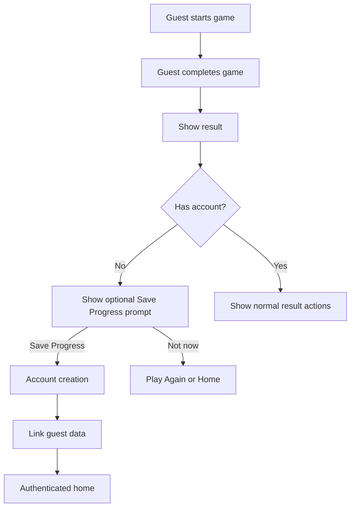

The best trigger is **when the guest has achieved something worth preserving**, not when the app first opens. For WordLoop, account creation should be optional at first and appear when the user tries to save progress, sync data, or use a feature that genuinely requires identity.[1][2]

## Recommended trigger

Use this primary moment:

> After the player completes their first game, show an optional prompt to save their progress.

This gives the player enough time to understand and experience WordLoop before asking for commitment. The prompt should appear on the game-over screen, after the result and before the user starts another round. Progressive engagement is generally preferable to forcing registration before the user experiences the product’s value.[3][1]

## Primary flow



## Recommended prompt

```text
Keep your WordLoop progress

Create an account to save your scores,
streaks, discovered words, and settings
across devices.

[ SAVE MY PROGRESS ]

[ NOT NOW ]
```

The prompt should explain the benefit rather than say only “Sign up.” Users are more likely to understand account creation when it is connected to a concrete outcome such as saving progress or using the app across devices.[4][1]

## Triggers to use

### After first completed game

Show a soft prompt after the first completed round:

```text
Save your first score?
Create an account to keep your progress.
```

This should not block the user from playing again.

### After repeated engagement

If the user dismisses the first prompt, show another only after meaningful engagement, such as:

- Completing three games.
- Achieving a personal best.
- Building a notable streak.
- Discovering several new words.
- Returning on another day.

Do not show the prompt after every round.

### When enabling cross-device sync

If the user opens a feature such as:

- Personal vocabulary history.
- Saved words.
- Statistics.
- Backup and restore.
- Cross-device play.

Show account creation because those features require persistent identity.

### From Settings

Include a clear but non-intrusive option:

```text
Account
Continue as guest
[Create Account]
```

This gives motivated users control without interrupting normal play.

## Triggers to avoid

Do not request an account:

- On the first app launch.
- Before the first game.
- Before selecting difficulty.
- Before submitting a word.
- Before viewing basic definitions.
- Because the user opened the app.
- Only to collect marketing data.

If a feature does not require identity, let the guest use it. Apple-related guidance and common guest-mode patterns support gating only features that genuinely require saving, syncing, posting, or purchasing.[2]

## Guest data model

Create an anonymous local guest profile immediately:

```text
GuestProfile
------------
guest_id
created_at
last_active_at
games_played
local_scores
local_streak
discovered_words
settings
```

The guest should be able to play without a server account. Store basic progress locally, then associate it with a permanent account when the user chooses to sign up.

## Account conversion flow

```text
Guest completes game
        ↓
Taps Save Progress
        ↓
Selects sign-up method
        ↓
Creates account or signs in
        ↓
Guest data is linked
        ↓
Confirmation shows transferred progress
```

After linking, show:

```text
Your progress is saved

Your scores, streaks, settings, and discovered
words are now linked to your account.

[ Continue Playing ]
```

The guest-to-account transition should preserve the user’s existing progress rather than create an empty account. Games commonly use account linking to secure guest progress and enable multi-device access.[5][4]

## Account options

For v1, offer the smallest practical set:

- Sign in with Apple.
- Google sign-in.
- Email magic link.

Avoid asking users to create and remember another password unless there is a clear reason.

Because WordLoop is launching on both iOS and Android, Apple and Google authentication can reduce friction. However, implement only the providers you can support reliably and explain how guest progress will be transferred.

## What gets transferred

When a guest creates an account, transfer:

- Completed games.
- Best score.
- Longest chain.
- Difficulty statistics.
- Discovered words.
- Saved vocabulary words.
- App settings.
- Hint preferences.

Do not transfer corrupted, incomplete, or duplicate records without a clear rule.

## Prompt frequency

Use a conversion policy such as:

```text
Prompt after first completed game.
If dismissed, wait until three more completed games.
If dismissed again, wait until the next meaningful achievement
  (personal best, streak milestone, new word discovery milestone, returning on a new day).
Maximum one soft prompt per session.
Maximum three soft prompts per 30-day cycle.
After the third dismissal in a cycle, suppress soft prompts for 30 days.
After 30 days, the cycle resets and soft prompts can resume, starting from the next
  qualifying trigger (not automatically on day 31, waits for the next meaningful event).
Hard gates (sync, saved words, statistics, or future purchases) are not subject to
  this cap and always prompt account creation when that feature is opened.
```

This prevents the account request from becoming an interruption.

## Account creation wireframe

```text
┌────────────────────────────────┐
│        Keep your progress      │
│                                │
│  Save scores, streaks, and     │
│  discovered words across       │
│  devices.                     │
│                                │
│       [ Sign in with Apple ]   │
│       [ Continue with Google ] │
│       [ Email me a link ]      │
│                                │
│  Your guest progress will be   │
│  linked to this account.       │
│                                │
│            [ Not now ]          │
└────────────────────────────────┘
```

The phrase **“Your guest progress will be linked to this account”** is important because it removes the fear that the player will lose their existing scores.

## Recommended WordLoop decision

Use this policy:

- Guest play is available immediately.
- No account is required for the core game.
- Prompt after the first completed game to save progress.
- Prompt again only after meaningful engagement.
- Require an account only for syncing, permanent history, leaderboards, purchases, or future school access.
- Preserve and transfer all valid guest data during account creation.
- Let users dismiss the prompt without losing access to gameplay.

This gives WordLoop a low-friction first experience while creating a natural reason for account creation later.

Sources
[1] The Top 5 App Onboarding Best Practices to Skyrocket ... https://semnexus.com/the-top-5-app-onboarding-best-practices-to-skyrocket-retention-in-2026
[2] Login is not required for features that do not need identity - AuditBuffet https://auditbuffet.com/patterns/ab-000513
[3] Guest Conversion Feature. Get users into your app ... https://medium.com/@ericmorgan1/guest-conversion-feature-42c65bb320f
[4] How to Link Your EA SPORTS FC™ Mobile Account https://www.youtube.com/watch?v=8Rc3AurKCJM
[5] How to Transfer your Guest Account on Call of Duty Mobile 2024? https://www.youtube.com/watch?v=kKC6qAQnkWI
[6] The Right Way to Design Guest Checkout for Mobile and Desktop https://www.youtube.com/watch?v=8ZsOd5VVz4g
[7] Guest User Best Practice - App Organization https://forum.bubble.io/t/guest-user-best-practice/294668
[8] The importance of guest browsing and checkout feature in mobile ... https://blog.appmysite.com/the-importance-of-guest-browsing-and-checkout-feature-in-mobile-apps/
[9] How to Save Guest Account Progress in apex Legends Mobile https://www.youtube.com/watch?v=NyVy9O56a_4
[10] If I log in to my guest account will my progress and in game purchases be saved https://www.reddit.com/r/warthundermobile/comments/1jcba11/if_i_log_in_to_my_guest_account_will_my_progress/
