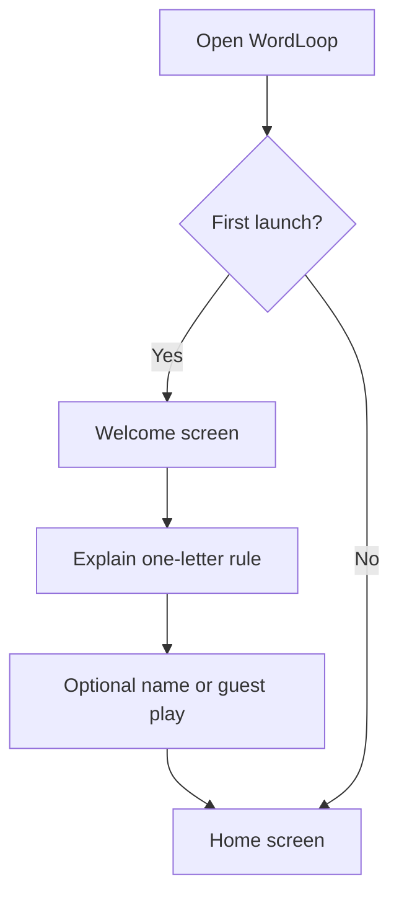
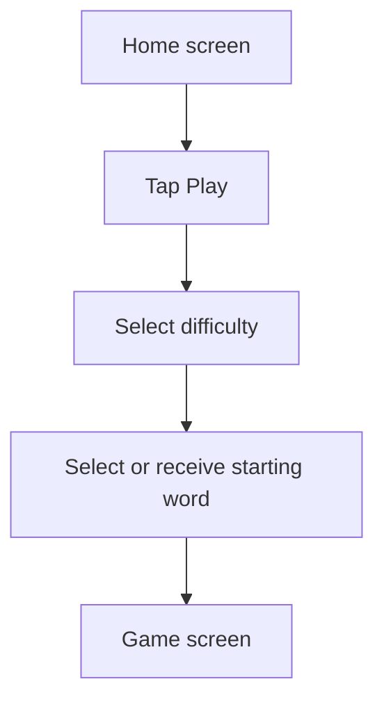
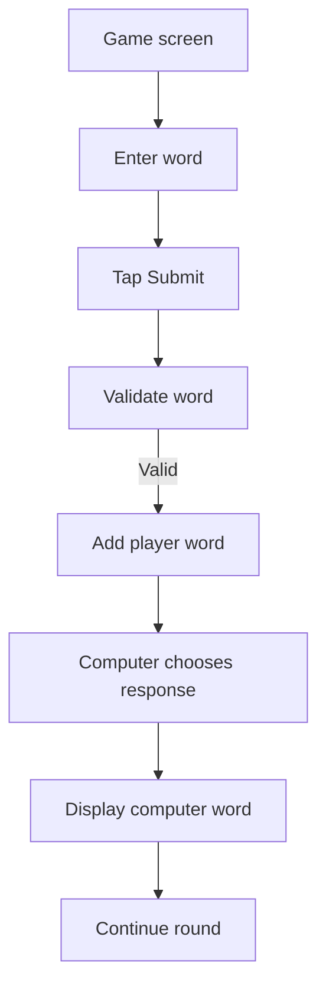
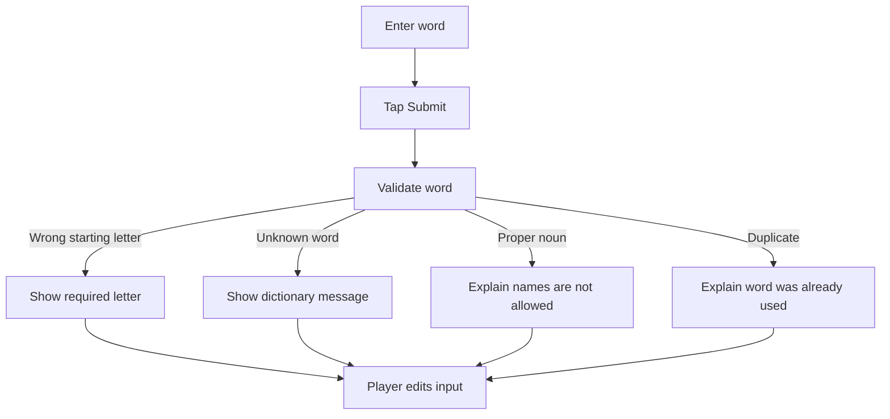
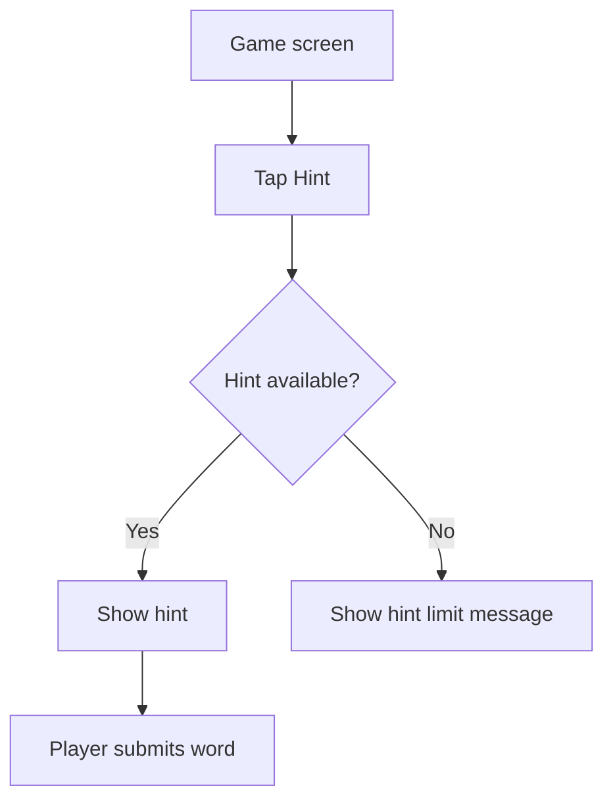
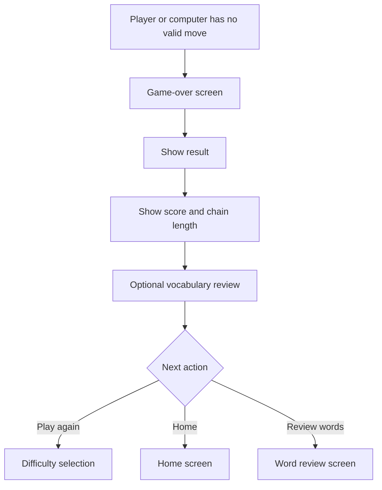

# WordLoop User Flows and Wireframe Requirements

WordLoop’s design should be built around one dominant flow: **open the app, start a round quickly, submit words, understand feedback, and replay**. Wireframes should first define structure, navigation, content hierarchy, interaction states, and annotations—not colours or visual polish.[1][2][3]

## 1. Core user flows

### Flow A: First launch



### Flow B: Start a game



### Flow C: Submit a valid word



### Flow D: Submit an invalid word



### Flow E: Use a hint



### Flow F: End of game



## 2. Primary navigation

For v1, avoid a complex navigation system. The minimum structure should be:

```text
Welcome
   ↓
Home
   ├── Play
   ├── How to Play
   ├── Word Review
   └── Settings

Play
   ↓
Difficulty
   ↓
Game
   ├── Hint
   ├── Word Definition
   ├── Pause
   └── Game Over
```

The main navigation should prioritise starting a game. The user should not need to create an account, configure a profile, or complete lengthy onboarding before playing.

## 3. Wireframe principles

Wireframes should initially be grayscale and low fidelity so that you evaluate layout and interaction rather than colours, branding, or decoration. They should show navigation, controls, content hierarchy, realistic text lengths, and annotations for behaviour.[3][4][5]

Each important screen should include:

- Screen purpose.
- Navigation elements.
- Primary action.
- Secondary actions.
- Content hierarchy.
- Interactive controls.
- Empty state.
- Loading state.
- Error state.
- Disabled state.
- Tap behaviour.
- Back-navigation behaviour.[5][3]

## 4. Required wireframes

### 4.1 Welcome screen

#### Purpose

Explain WordLoop in a few seconds and move the user into gameplay.

#### Required elements

```text
+--------------------------------+
|            WordLoop            |
|                                |
|       Build the word chain     |
|                                |
|  Each word starts with the     |
|  last letter of the previous   |
|  word.                         |
|                                |
|          [Play Now]            |
|                                |
|       [How to Play]            |
+--------------------------------+
```

#### Behaviour

- `Play Now` opens the home screen or difficulty selection.
- `How to Play` opens the rules screen.
- No account is required.
- The screen should not contain a long explanation.

## 5. Home screen

#### Purpose

Give the user immediate access to gameplay and optional secondary functions.

```text
+--------------------------------+
| WordLoop                  ⚙    |
|                                |
|        Ready for a chain?      |
|                                |
|          [Start Game]          |
|                                |
|   Best Score       Best Streak |
|      120              14       |
|                                |
| [Word Review] [How to Play]    |
+--------------------------------+
```

#### Required elements

- Start Game button.
- Best score.
- Best streak or longest chain.
- Word Review entry.
- How to Play entry.
- Settings entry.
- Optional daily challenge placeholder.

#### Important decision

Do not add a shop, social feed, leaderboard, or school dashboard to the home screen in v1. They would compete with the main action.

## 6. Difficulty selection screen

#### Purpose

Let the player select the challenge level with understandable descriptions.

```text
+--------------------------------+
|          Choose Difficulty     |
|                                |
| [Easy]                         |
| Relaxed play                  |
| Computer chooses broadly      |
|                                |
| [Medium]                       |
| Computer starts blocking      |
|                                |
| [Hard]                         |
| Computer looks for traps       |
|                                |
|              [Continue]        |
+--------------------------------+
```

#### Requirements

- Easy, Medium, and Hard options.
- One selected state.
- Plain-language descriptions.
- Optional “How difficulty works” link.
- Continue button.
- Back button.

#### Behaviour

- Default selection: Easy.
- Continue remains disabled until a difficulty is selected, unless Easy is preselected.
- The selected difficulty must persist into the game session.

## 7. How-to-play screen

#### Purpose

Explain the game without requiring the user to read a manual.

```text
+--------------------------------+
|          How to Play           |
|                                |
| Computer: APPLE                |
| You need a word starting with E|
|                                |
| You: ELEPHANT                 |
| Computer needs a word starting |
| with T                         |
|                                |
| Names are not allowed.         |
| Repeated words are not allowed.|
| Minimum length: 3 letters.     |
|                                |
|             [Got It]           |
+--------------------------------+
```

#### Requirements

Explain only the v1 rules:

- Start with the required letter.
- Use a valid dictionary word.
- Do not use names.
- Do not repeat words.
- Minimum three letters.
- Use hints if available.

The screen should include a real example rather than only abstract instructions.

## 8. Game screen

This is the most important wireframe and should receive the greatest design attention.

```text
+--------------------------------+
| ←  Medium          ⏸           |
|                                |
| Chain: 8 words     Score: 72   |
|                                |
| Computer                         |
|                         TABLE  |
|                                |
| Required letter                 |
|              E                 |
|                                |
| apple → elephant → table       |
|                                |
| Your word                       |
| [________________________]      |
|                                |
| [Submit]        [Hint]          |
|                                |
| [View previous words]           |
+--------------------------------+
```

### Required elements

- Back or exit control.
- Pause control.
- Difficulty indicator.
- Score.
- Chain length.
- Current word.
- Required starting letter.
- Word input.
- Submit button.
- Hint button.
- Recent chain display.
- Turn indicator.
- Loading state for the computer response.

### Key interaction rule

The required letter must be visually prominent. The player should not need to infer it from the previous word.

### Input behaviour

- Automatically focus the input when the player’s turn begins.
- Support keyboard submission.
- Disable Submit while the input is empty.
- Trim spaces before validation.
- Handle uppercase and lowercase equivalently.
- Prevent submission while the computer is responding.
- Show a clear loading state.

## 9. Game screen states

The game screen must have separate wireframe states.

### Player turn

```text
Required letter: E
Input: active
Submit: enabled when valid text exists
Hint: enabled if available
```

### Input empty

```text
Input: empty
Submit: disabled
Message: “Enter a word beginning with E”
```

### Validating

```text
Input: disabled
Submit: loading
Message: “Checking word…”
```

### Computer thinking

```text
Input: disabled
Message: “WordLoop is thinking…”
```

### Invalid word

```text
Input: retains submitted word
Error: “Try a word beginning with E.”
Submit: enabled after editing
```

### Valid move

```text
Player word added to chain
Computer response appears
Next required letter updated
Input cleared
```

### No computer move

```text
Message: “The computer has no valid word.”
Action: [Finish Round]
```

## 10. Invalid word feedback

The error design should explain the cause and the next action.

| Situation | Message | Suggested action |
|---|---|---|
| Wrong starting letter | “Your word must begin with E.” | Edit the word |
| Unknown word | “That word is not in this game’s word list.” | Try another word |
| Proper noun | “Names and proper nouns are not allowed.” | Try a common word |
| Duplicate | “You already used that word.” | Choose a new word |
| Too short | “Words must contain at least three letters.” | Enter a longer word |
| Unsupported symbols | “Use letters only.” | Remove punctuation or numbers |
| Offensive/excluded word | “That word cannot be used in WordLoop.” | Choose another word |

The app should avoid revealing internal dictionary details that confuse casual players.

## 11. Hint bottom sheet

The Hint action should open a lightweight overlay rather than navigate away from the round.

```text
+--------------------------------+
|           Hint                 |
|                                |
| Your word must begin with:     |
|              E                 |
|                                |
| Example: ELEPHANT              |
|                                |
| This hint will reduce your     |
| available hints by one.        |
|                                |
| [Use Hint]       [Cancel]      |
+--------------------------------+
```

Possible hint levels:

1. Required letter.
2. Number of available common words.
3. Example word.
4. Definition-based clue.

Do not automatically reveal a word unless the user explicitly chooses that level of help.

## 12. Word definition overlay

Definitions should be optional and should not interrupt the turn.

```text
+--------------------------------+
|             TABLE              |
|                                |
| Noun                           |
| A piece of furniture with a    |
| flat top and one or more legs. |
|                                |
| [Close]                        |
+--------------------------------+
```

If definitions are unavailable:

```text
Definition unavailable for this word.
You can continue playing.
```

The game must never block a round because an enrichment API is unavailable.

## 13. Pause screen

```text
+--------------------------------+
|             Paused             |
|                                |
| [Resume Game]                  |
| [How to Play]                  |
| [Restart Game]                 |
| [Exit to Home]                 |
+--------------------------------+
```

### Requirements

- Preserve the current game state.
- Do not lose the chain if the user leaves temporarily.
- Confirm before restarting or exiting.
- Pause computer timers if timers are added later.

## 14. Game-over screen

```text
+--------------------------------+
|          Round Complete        |
|                                |
|          You Win!              |
|                                |
| Score: 120                     |
| Words played: 18               |
| Longest chain: 18              |
|                                |
| [Review Words]                 |
| [Play Again]                   |
| [Home]                         |
+--------------------------------+
```

### Required result states

- Player wins.
- Computer wins.
- Draw or exhausted dictionary.
- Player exits.
- Technical failure.

### Optional result content

- New words discovered.
- Most difficult letter.
- Hints used.
- Personal best indicator.
- Encouraging message.

Avoid overly competitive language for a learning-oriented casual game.

## 15. Word review screen

```text
+--------------------------------+
|          Word Review           |
|                                |
| ELEPHANT                       |
| [Definition] [Pronunciation]   |
|                                |
| TABLE                          |
| [Definition] [Pronunciation]   |
|                                |
| QUARTZ                         |
| [Definition] [Pronunciation]   |
|                                |
| [Back to Home]                 |
+--------------------------------+
```

### Requirements

- Show words from the completed round.
- Distinguish player and computer words if useful.
- Allow definitions to load independently.
- Display a loading state per word.
- Display an unavailable state without blocking the list.
- Later support saving words to a personal vocabulary list.

## 16. Settings screen

### v1 settings

- Account
  - Continue as guest (default state)
  - Create Account (opens account creation flow)
  - If signed in: show linked provider (Apple / Google / Email) and Sign Out
- Sound on/off.
- Haptic feedback on/off.
- ~~Dark mode or system theme.~~ **Cut from v1 — Delivery Plan D-05, closed 2026-08-26.**
  No dark palette exists (Design System §9), and designing one properly was judged not
  worth the Phase 2 cost for a maximalist warm-paper palette with no obvious dark
  translation. Target for a post-v1 release once a real dark palette is designed.
- Text size or accessibility option.
- Reset local statistics.
- Privacy policy.
- Terms of use.
- Report a word.
- Contact/support.

+--------------------------------+
|            Settings            |
|                                |
| Account                        |
| Continue as guest              |
| [Create Account]               |
|                                |
| Sound                    [On]  |
| Haptics                  [On]  |
| Theme              [System]    |
| Text Size            [Default] |
|                                |
| [Reset Statistics]             |
| [Report a Word]                |
| [Privacy Policy]               |
| [Terms of Use]                 |
| [Contact Support]              |
+--------------------------------+

## 17. Empty and error states

Every important screen needs state definitions.

### Home without statistics

```text
No games completed yet.
Start your first chain to build your score.
```

### Word review empty state

```text
No reviewed words yet.
Play a game to discover new vocabulary.
```

### Network unavailable

```text
You are offline.
You can continue playing with the downloaded word list.
Definitions and statistics sync later.
```

### Dictionary unavailable

```text
Word checking is temporarily unavailable.
Please try again shortly.
```

### Computer response timeout

```text
WordLoop is taking longer than expected.
[Try Again] [End Round]
```

## 18. Accessibility requirements

The wireframes should account for:

- Large, readable text.
- High contrast.
- Screen-reader labels.
- Large tap targets.
- No colour-only meaning.
- Clear focus states.
- Keyboard submission.
- Reduced-motion option.
- Accessible error announcements.
- Support for portrait mobile use.

The required letter should be communicated through text and not only colour or animation.

## 19. Responsive requirements

The primary design target is mobile portrait.

Also consider:

- Small phones.
- Large phones.
- Tablets.
- Landscape orientation.
- Android back button.
- iOS safe areas.
- On-screen keyboard reducing vertical space.

The game screen must remain usable when the keyboard is open. The input and Submit button should not be hidden below the keyboard.

## 20. Wireframe annotations

Every wireframe should contain notes for:

- What happens when a control is tapped.
- What happens during loading.
- What happens when validation fails.
- Whether the user can go back.
- Whether the current game is saved.
- What happens if the app is closed.
- Whether the action requires network access.
- What analytics event is recorded.

Wireframes are more useful when they communicate behaviour, not just screen appearance.[3][5]

## 21. Recommended wireframe order

Create the wireframes in this order:

1. Game screen.
2. Invalid move states.
3. Computer-thinking state.
4. Game-over screen.
5. Difficulty selection.
6. Home screen.
7. How-to-play screen.
8. Hint overlay.
9. Word review.
10. Settings.

The game screen should be designed first because it contains the product’s core loop.

## 22. MVP wireframe set

For the first prototype, you only need:

- Welcome screen.
- Home screen.
- Difficulty selection.
- How-to-play screen.
- Game screen.
- Invalid-word state.
- Computer-thinking state.
- Game-over screen.
- Hint overlay.

Do not design every future feature before testing the core flow.

## 23. Wireframe acceptance criteria

The wireframes are ready for development review when:

- A new user can understand the game without external explanation.
- A user can start a game within two taps from Home.
- The required letter is always obvious.
- The player knows whose turn it is.
- Invalid words show a specific reason.
- The player can recover from every invalid input.
- The computer-thinking state is visible.
- The player can pause or exit safely.
- The round result is understandable.
- The player can immediately replay.
- Definitions and learning features are optional.
- Offline and failure states are documented.
- Account prompt shown (include trigger_type: first_game / three_games / personal_best /
  streak_milestone / new_words_milestone / returning_day / sync_feature_opened / settings_entry;
  include cycle_number and prompt_count_in_cycle)
- Account prompt dismissed (include trigger_type, cycle_number, prompt_count_in_cycle)
- Account prompt suppressed by cooldown (include cycle_number, days_remaining_in_cooldown)
- Account prompt cycle reset (fired when a 30-day suppression period ends and soft
  prompts become eligible again)
- Account creation started (include entry_point: game_over / settings / sync_feature / milestone)
- Account creation method selected (apple / google / email)
- Account creation completed
- Account creation abandoned
- Guest data linked to account (include counts: games_played, discovered_words, saved_scores)
- Signed out
- Guest-to-account conversion rate.
- Conversion rate by trigger type.
- Conversion rate by cycle number (does a player convert in cycle 1, 2, 3+, or only via hard gate).
- Average number of prompts shown before conversion.
- Percentage of players who reach cooldown suppression without converting.
- Drop-off rate during account creation (started vs. completed).
- Time from first game to account creation.

## 24. First prototype recommendation

Build the first clickable prototype around only this path:

```text
Welcome
  ↓
Home
  ↓
Difficulty
  ↓
Game
  ↓
Invalid input or valid move
  ↓
Computer response
  ↓
Game over
  ↓
Play again
```

Test this with five to ten people before designing the full visual identity. The most important discovery is whether players understand the rule, know what to do next, and want to play another round.[6][3]

Sources
[1] 🌊Give me a Flow! - Application of UX Flows in Game UX Design https://medium.com/@josselin.querne/give-me-a-flow-application-of-ux-flows-in-game-ux-design-6c6de77c60b8
[2] User Flow + Art (longterm) https://prattatatat.com/blog-full/2017/1/31/ui-arsenal-user-flows-wireframes
[3] App Wireframing Guide: Tools, Examples and How-To (2026) https://www.appypie.com/blog/app-wireframing-guide
[4] From Wireframe to UI for mobile game https://medium.com/@nhatlongcode/from-wireframe-to-ui-for-mobile-game-26115a358de6
[5] Wireframe Design for Mobile Apps: Process, Examples and ... https://www.saasfactor.co/blogs/wireframe-design-for-mobile-app
[6] UX Walkthrough: Prototype Testing Do's & Don'ts Part-1 https://www.gamedeveloper.com/business/ux-walkthrough-prototype-testing-do-s-don-ts-part-1
[7] Mobile UX - Games and fun word game interface ideas https://www.pinterest.com/brentonhouse/mobile-ux-games/
[8] Workflow of Creating Game UX/UI Design | PPTX https://www.slideshare.net/slideshow/workflow-of-creating-game-uxui-design/206307889
[9] UI/UX - Wordscapes - Lane Engelberg's Portfolio https://www.lane-engelberg.com/uiux-wordscapes
[10] Browse thousands of Word Game images for design inspiration https://dribbble.com/search/word-game
